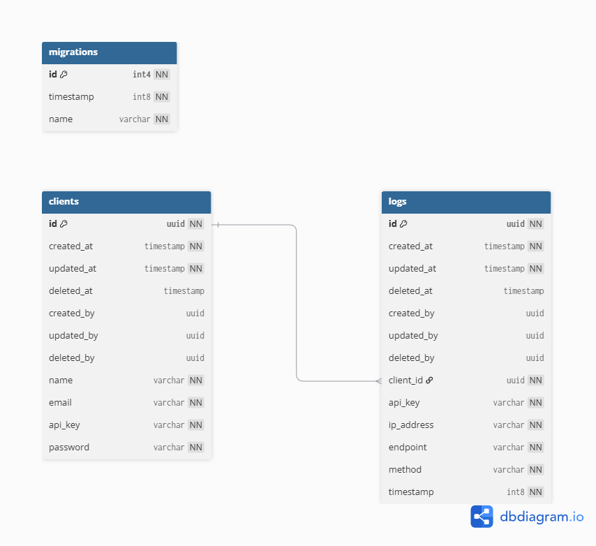

# User Activity Tracking Server

A high-performance backend system for tracking user API activity, built with NestJS and TypeScript. Designed to handle high-traffic scenarios with advanced caching strategies, concurrency management, and secure API handling.

**[Live Demo - Interactive API Documentation](https://user-activity-tracking-server.vercel.app/api)**

## Table of Contents

- [Tech Stack](#tech-stack)
- [Features](#features)
- [Architecture](#architecture)
- [Getting Started](#getting-started)
- [API Documentation](#api-documentation)
- [Database Design](#database-design)

## Tech Stack

- NestJS 11
- TypeScript 5.7
- PostgreSQL 16
- Redis 7
- Docker

## Features

- **Authentication System** - Client registration, JWT & API key authentication, password hashing
- **Activity Logging** - Batch queue service cache invalidation
- **Usage Analytics** - Daily statistics and top clients aggregation queries
- **Caching Layer** - Redis with local LRU fallback
- **Rate Limiting** - Redis-backed rate limiter
- **Security** - Dual authentication, encrypted API keys, input validation, SQL injection protection
- **Database** - PostgreSQL with TypeORM migrations, indexed fields, UUID primary keys
- **API Documentation** - Swagger UI with OpenAPI specification
- **Docker Setup** - Multi-stage Dockerfile with Docker Compose configuration

## Architecture

```
src/
├── config.ts                       # Centralized configuration
├── main.ts                         # Application entry point
├── app.module.ts                   # Root module
│
├── modules/                        # Feature modules
│   ├── auth/                       # Authentication module
│   │   ├── controllers/            # Register & Login endpoints
│   │   ├── services/               # Auth business logic
│   │   └── dtos/                   # Request/Response DTOs
│   │
│   ├── client/                     # Client module
│   │   └── repositories/           # Data access layer
│   │
│   ├── log/                        # Activity logging module
│   │   ├── controllers/            # Log recording endpoint
│   │   ├── services/               # Batch queue & business logic
│   │   ├── repositories/           # Log data access
│   │   └── dtos/                   # Request/Response DTOs
│   │
│   └── usage/                      # Usage analytics module
│       ├── controllers/            # Daily & top usage endpoints
│       ├── services/               # Caching & business logic
│       └── dtos/                   # Response DTOs
│
├── infrastructures/                # Infrastructure layer
│   ├── database/
│   │   ├── entities/               # TypeORM entities (Client, Log)
│   │   ├── migrations/             # Database migrations
│   │   └── config.ts               # Database configuration
│   │
│   └── modules/
│       ├── jwt/                    # JWT authentication
│       │   ├── strategies/         # Passport JWT strategy
│       │   ├── guards/             # JWT auth guard
│       │   └── enums/              # JWT types
│       │
│       ├── api-key/                # API key authentication
│       │   ├── strategies/         # Passport API key strategy
│       │   ├── guards/             # API key auth guard
│       │   └── enums/              # API key types
│       │
│       ├── redis/                  # Redis module
│       │   └── services/           # Redis client, pub/sub
│       │
│       └── local-cache/            # Local LRU cache
│           └── services/           # In-memory cache service
│
└── shared/                         # Shared utilities
    ├── constants/                  # Constants (cache keys, messages)
    ├── decorators/                 # Custom decorators (@Public, @RateLimit)
    ├── exceptions/                 # Custom exceptions (429)
    ├── filters/                    # Global exception filter
    ├── guards/                     # Rate limit guard
    ├── interfaces/                 # Shared interfaces
    └── utils/                      # Helper utilities (Cache, Mask, Hash, Encryption)
```


## Getting Started

### 1. Clone the repository

```bash
git clone https://github.com/mch-fauzy/user-activity-tracking-server.git
cd user-activity-tracking-server
```

### 2. Set up environment variables

```bash
cp .env.example .env
```

Edit `.env` if needed to customize configuration.

### 3. Build and start all services

```bash
make build
make up
```

This will start:
- PostgreSQL on port `5432`
- Redis on port `6379`
- Application on port `3000`

### 4. Run database migrations

```bash
make migrate
```

### 5. Access the application

- **API**: http://localhost:3000
- **Swagger Documentation**: http://localhost:3000/api

## API Documentation

All API endpoints are documented using Swagger/OpenAPI and can be accessed interactively at:

```
http://localhost:3000/api
```

### Live Demo

**Interactive Swagger Documentation is Available Online:**

- **Access at:** [https://user-activity-tracking-server.vercel.app/api](https://user-activity-tracking-server.vercel.app/api)

For detailed request/response schemas and to test the APIs, visit the Swagger UI.

## Database Design



